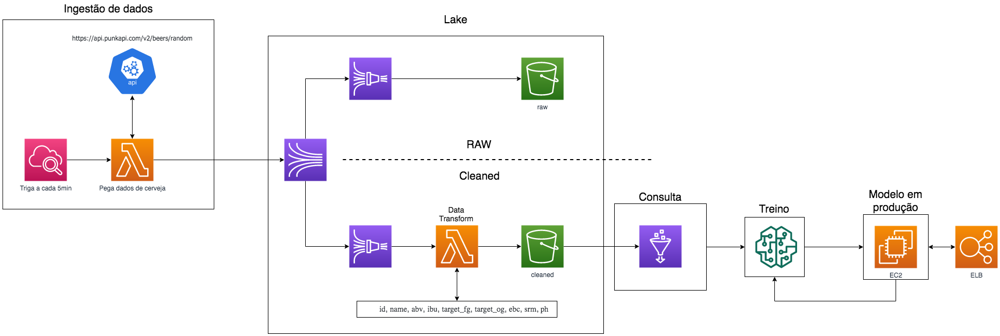
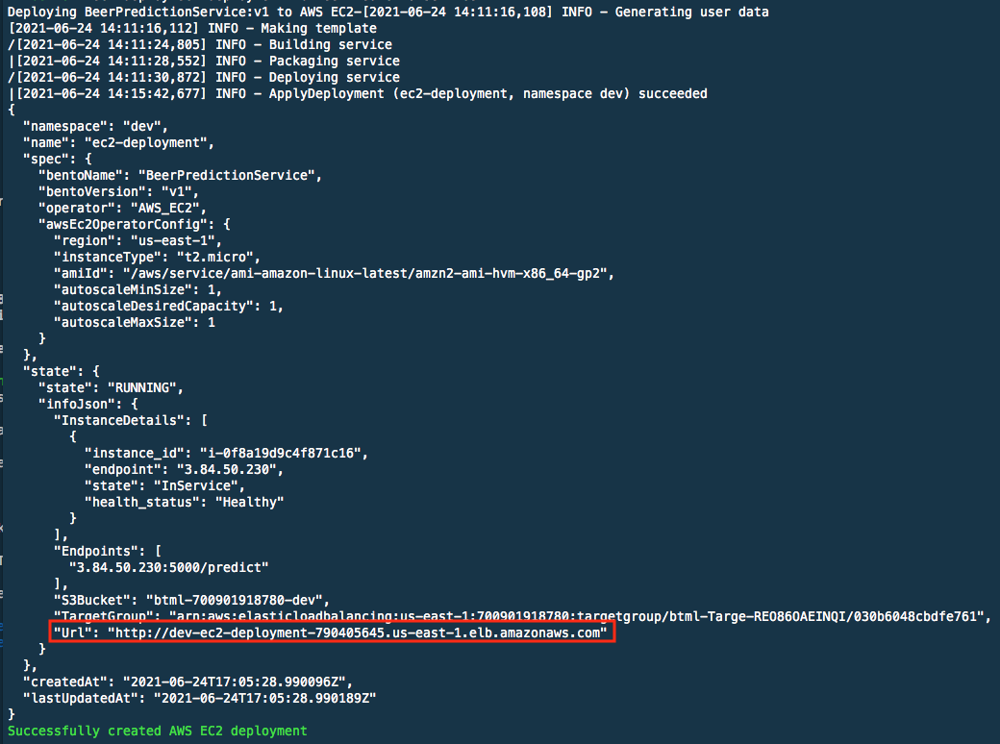
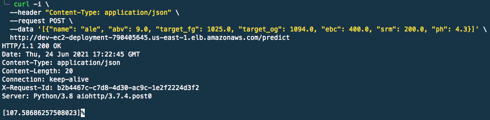
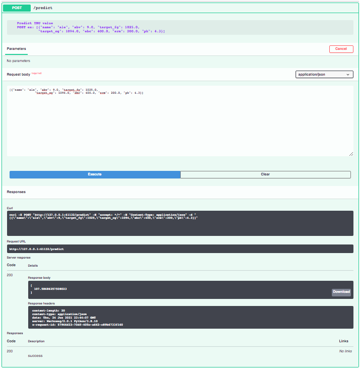
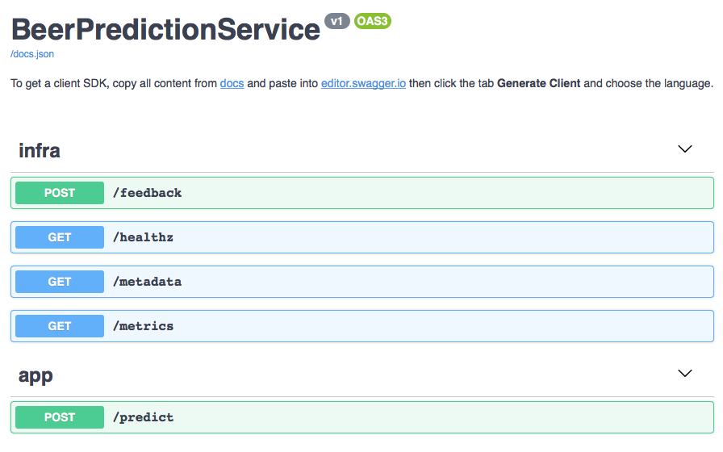

# Machine Learning Engineer - PicPay
Teste para Ml. Eng. no PicPay



O Projeto foi separado em 4 partes

1. Ingestão de dados
2. Data Lake
3. Disponibilização dos dados (Consulta)
4. Produtização (Retreino e Modelo em produçao)

Para a construção das partes 1, 2 e 3 utilizei o `terraform` e para o deploy do modelo em lambda utilizei o framework [bentoml](https://docs.bentoml.org/en/latest/)

## Descrição do projeto

O projeto consiste em coletar os dados da [PunkAPI](https://api.punkapi.com/v2/beers/random) via Lambda (Etapa 1), que é uma api com informações de cerveja da cervejaria BrewDog. Após a coleta dos dados, a mesma lambda envia os dados coletados ao Kinesis (Ínicio etapa 2), que distribui esses dados em dois seguimentos:, 
 - Raw: Utilizando o Kinesis Firehose, o dado é armazenado no S3, no bucket `raw`, no mesmo estado que foi coletado (dado cru).
 - Cleaned: Utilizando o Kinesis Firehose e uma lambda, o dado capturado é manipulado, deixando somente as informações de id,
name, abv, ibu, target_fg, target_og, ebc, srm e ph das cervejas e salvo no S3, no bucket `cleaned`. Para esse bucket também é criado uma tabela para que os dados sejam acessados (Etapa 3), isso é feito utilizando o Glue Crawler e o Glue Data Catalog.

Com a tabela criada, leio os dados da tabela e treino o modelo para inferir o IBU de uma cerveja baseado nos dados que a api fornece (`name`, `abv`, `ibu`, `target_fg`, `target_og`, `ebc`, `srm`, `ph`).

Com o modelo criado, vem a produtização (etapa 4), para isso utilizei o framework bentoml, que abstrai a conteinerização do modelo. Adotei a opção de deploy em uma EC2 com um ELB (Elastic Load Balancer) que provisiona uma url para fazermos as chamadas na api.

***
## Estrura de pastas

```

├── docs
│   └── desafio_-_machine_learning_platform_engineer.pdf
├── figuras
├── lambdas
│   ├── lambda_databeer_transformation
│   ├── lambda_punkapi
│   └── README.md
|
├── main.tf
├── model
│   ├── bentoml
│   ├── imagens
│   ├── server
│   ├── model.ipynb
│   ├── retrain.py
│   ├── utils.py
│   └── server
|
├── requirements.txt
└── terraform
    ├── README.md
    ├── consulta
    ├── ingestao_dados
    └── lake

```
- **lambdas**: 
- **model**: Tudo relacionado ao modelo está nessa pasta. O notebook utilizado para o desenvolvimento é o arquivo `model.ipynb`.
    - *bentoml*: Todos os arquivos necessários para deploy do modelo em lambda utilizando o [bentoml](https://docs.bentoml.org/en/latest/).
    - *server*: Arquivos referentes ao deploy do modelo.
    - *utils* : Módulo com funções em python uteis ao modelo.
- **terraform**: Todo o código terraform do projeto está nessa pasta, separado segundo o diagrama apresentado:
    - *consulta*: Códgio que cria toda a estrutura de tabelas no glue e no athena.
    - *ingestao_dados*: Código que cria a parte do CloudWatch Event e da lambda de ingestão.
    - *lake*: Código para o Kinesis, Kinesis Firehose, Lambda e S3.


***
## Depências do projeto.
 - [Conta AWS](https://aws.amazon.com/account/sign-up)
 - [Docker](https://docs.docker.com/engine/install/)
 - [Terraform](https://learn.hashicorp.com/tutorials/terraform/install-cli)=v1.0.0
 - Python >= 3.8
***
## Como utilizar esse repositório.

Primeiro, você deve definir algumas variáveis de ambiente.

```bash
export BENTOML_HOME="model/bentoml"
export AWS_ACCESS_KEY_ID="<sua acess key aws>"
export AWS_SECRET_ACCESS_KEY="<sua secret acess key aws>"
export AWS_DEFAULT_REGION="<sua region aws>"
```

Com as variáveis definidas, podemos iniciar o deploy da aplicação.

Para isso vamos usar uma arquivo `Makefile` para tornar o processo mais simples.

Você pode ver o que cada função do `Makefile` faz rodando `make help`, mas o processo será:

1. `make venv` 
2. `make deploy_infra`
3. `make deploy_model version=v1`

Para retreino do modelo, execute:

```bash
make retrain version=v#
```
***
#### Deploy do modelo
Após executar `make deploy_model`, após uns 5minutos você deve ver o log abaixo:

O quadrado vermelho mostra a url de acesso a interface do Swagger/OpenAPI

Para fazer uma chamada no enpoint criado basta executar o comando:


Você pode acessar a url e executar pela interface do Swagger também:
swagger-predict
***
## Acessos na AWS
Para poder executar o projeto de forma correta, é preciso ter acesso aos seguintes serviços:
- Kinesis
- KinesisFirehose
- S3
- Glue
- IAM
- CloudWatch
- EC2
- ELB
***

## Teste Local do Modelo

É possivel testar a api do modelo localmente, para isso, execute o seguinte comando:

```bash
make serve version=v1
```
or
```bash
make serve_docker
```
A opção `serve_docker` irá utilzar a imagem do modelo armazenada no DockerHub.

Um servidor local irá export uma URL para acessar o Swagger/OpenAPI.


No endpoint predict há um exemplo de como fazer o request.

