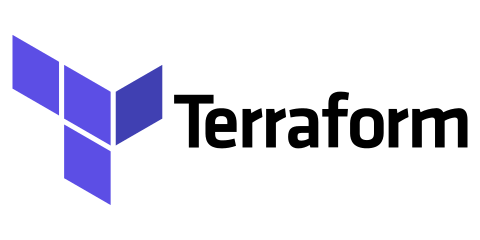

# Módulos Terraform
  

Códigos para criação de toda a infra do projeto

- *consulta*: Códgio que cria toda a estrutura de tabelas no glue
- *ingestao_dados*: Código que cria a parte do CloudWatch Event e da lambda de ingestão
- *lake*: Código para o Kinesis, Kinesis Firehose, Lambda e S3